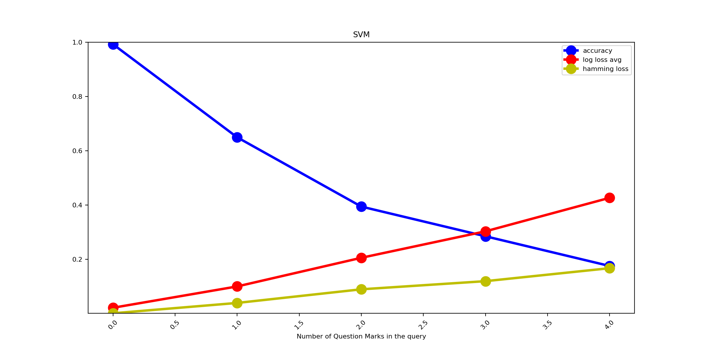
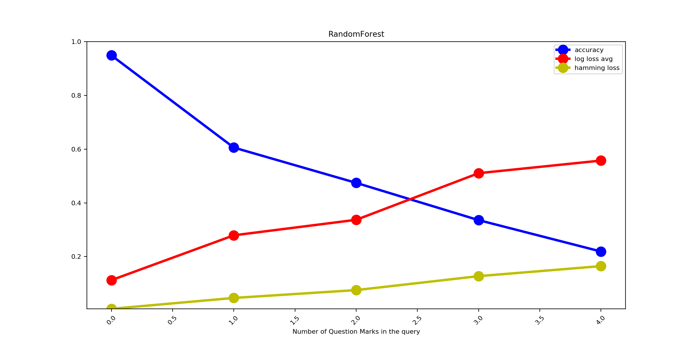
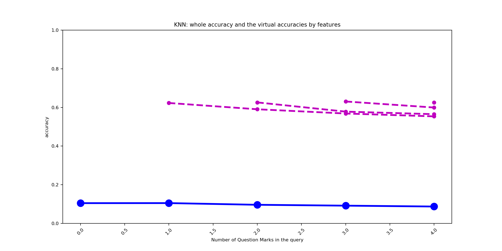

# Homework 03 - Machine learning a.a. 2018/19

## Index
1. [Utilized library](#utilized-library)
2. [Script](#script)
    1. [Usage](#usage)
    2. [Steps](#steps)
    3. [Notes](#notes)
3. [Reports description](#reports-description)
4. [Breast Cancer Wisconsin](#breast-cancer-wisconsin)
    1. [Report](#report)
    2. [Graphs](#graphs)
        1. [Multilayer Perceptron](#multilayer-perceptron)
        2. [Support Vector Machine](#support-vector-machine)
        3. [Random Forest](#random-forest)
        4. [K-Nearest Neighbors](#k-nearest-neighbors)
        5. [All together](#all-together)
    3. [Conclusions](#conclusions)        
5. [Letter Recognition](#letter-recognition)
    1. [Report](#report-1)
    2. [Graphs](#graphs-1)
        1. [Multilayer Perceptron](#multilayer-perceptron-1)
        2. [Support Vector Machine](#support-vector-machine-1)
        3. [Random Forest](#random-forest-1)
        4. [K-Nearest Neighbors](#k-nearest-neighbors-1)
        5. [All together](#all-together-1)
    3. [Conclusions](#conclusions-1)   

## Utilized library

Le librerie utilizzate sono:

* **pandas**: caricamento e manipolazione del **DataSet**
* **numpy, collections**: strutture dati evolute (array, matrici)
* **sklearn**: algoritmi, statistiche e suddivisione del **TrainingSet**
* **argparse**: command line script parsing
* **matplotlib**: grafici

## Script

Lo script cerca di capire con che probabilità e precisione i diversi **modelli di apprendimento** (*MLP*, *SVM*, *RandomForest*, *KNN*) riescono a prevedere i **valori mancanti** di un sample (sostituiti con dei **'?'**).

I *vettori di probabilità* sono salvati nella cartella `csv` ed i grafici in `imgs`. 

I test sono eseguiti sui *DataSet*: **breast-cancer**, **letters**.

> **nota**: è supportato anche il *poker* nei DataSet, ma visti gli eccessivi tempi di esecuzione, non si è riuscito ad ottenere i dati

### Usage

```bash
main.py [-h] [--test-size TEST_SIZE] [--question-marks-ts QM_REPETED_TS] [--no-split]
        [--img-tag IMG_TAG] [--verbose]
        [DATASET]
```

* **DATASET**: [breast-cancer|letters|poker] - seleziona il *DataSet*. Default è *breast-cancer*
* **--test-size TEST_SIZE, -t TEST_SIZE**: [0-1] - dimensione del *TestSet*. Default 0.2
* **--question-marks-ts QM_REPETED_TS, -q QM_REPETED_TS**: {0,1,2...} - indica il numero di sample che verranno aggiunti al DataSet per ogni *'?'* nella query. Default 1
* **--no-split, -s**: usa tutto il *DataSet* per il training. Disabilitato di default
* **--img-tag IMG_TAG, -i IMG_TAG**: string - aggiunge una stringa ai nomi dei file salvati dei grafici
* **--verbose, -v**: abilita, e incrementa ripetendola, il verbose durante il training
* **-h, --help**: visualizza l'help

> **nota**: QM_REPETED_TS quando la query contiene fino a 4 *'?'* (question marks), aggiungerà al TrainingSet: QM_REPETED_TS * 4 * |TrainingSet| samples.

> **nota**: Le altre opzioni come i parametri per i classificatori, il numero di *'?'* nella query, etc... sono configurabili nel sorgente.

### Steps

Vediamo sinteticamente gli **steps** dell'algoritmo:
1. **Ripulisce** il *Dataset*
    1. **Elimina** i *'?'*, per evitare di copiarli successivamente nell'output
    2. **Rimuove** il vero output
    3. **Converte** tutti i valori in interi
2. **Copia** le features come output
3. **Divide** "orizzontalmente" il *DataSet* in *TrainingSet* e *TestSet*
4. **Aggiunge** i **'?'** (question marks) nell'input del *TrainingSet*
    1. Per *QM_REPETED_TS*
        1. Per ogni sample nel *TrainingSet* 
            1. **Aggiunge** *N* sample con rispettivamente *1...N* *'?'* in posizioni random
            2. Dove *N* sono il numero di **'?'** nelle **queries** che faremo con il *TestSet* (Default 4)
5. **Separa** "verticalmente" l'input (con i *'?'*) dall'output del *TrainingSet*
6. **Separa** "verticalmente" l'input (senza i *'?'*) dall'output del *TestSet*
7. Esegue l'encoding **OneHot** (*characteristic vector*) dell'input del *TrainingSet*
    1. Garantendo che il **'?'** venga trasformato in **vettore nullo**
8. Per ogni **modello/classificatore** (*MLP*, *SVM*, *RandomForest* e *KNN*)
    1. Esegue l'**apprendimento** (un training diverso per output)
    2. **Aggiunge** da *0...N* **'?'** (random position) ad ogni sample del *TestSet* (costruendo le queries)
    3. Per ogni *TestSet* generato (*N+1*)
        1. Effettua il *OneHot* sul *TestSet* generato
        2. **Calcola e stampa** le varie **metriche**: *accuracy*, *log_loss*, *hamming loss* (sulle singole features e globalmente)
    3. Visualizza i **grafici** per il *modello/classificatore* corrente
9. Visualizza il **grafico** di raffronto tra i *modelli*             

> **nota**: ci sono altri passaggi e verifiche non descritte, ma ben commentate nel codice. Per visualizzare più dettagli sui passaggi durante l'esecuzione: `main.py -vvv`          

### Notes

Avendo in uscita più output (le stesse features di input), si è utilizzata la classe `MultiOutputClassifier`.  
In sostanza, questa non fa altro che splittare il problema in *N modelli* (uguali) con un singolo output, con *N* pari al numero di **output** del *TrainingSet*.
A ogni *modell*o verrà fornità la **query** e prevederà il **suo** output, che poi verrà ricomposto dando il risultato alla query.

Questo ovviamente implica il training di *N* modelli, su di un *TrainingSet* già cresciuto notevolmente per l'inserimento dei *'?'*.

> **nota**: **sklearn** prevede anche le classi `OneVsRestClassifier` e `MultiLabelBinarizer` per problemi con *multi-output*, ma dove questi sono *"interdipendenti"* e *"mutualmente escludibili"* fra loro (ie. non utilizzabile in questo caso).

---

Si è implementa la funzione **no-split** (vedi cli arguments) per consentire di effettuare il training su tutto il *DataSet* e confrontare i risultati con opzione disabilitata. Ovviamente il *TestSet*, avendo i *'?'* nelle *queries*, non fornirà degli input *"già visti"* al *modello di previsione*.

---

La funzione `reduce_y_to_qm()` è stata scritta per *"ridurre virtualmente"* gli output al numero di *'?'* nella query. Questo perchè, prendendo sempre tutti gli output ed essendo i **missing values** distribuiti randomicamente, l'**accuracy** viene calcolata sia in casi in cui si prevede un *'?'*, sia in casi in cui viene fornita la feature in input. eg:
```
[1, 4, ?, 2, ?] => [1, 4, 3, 2, 7] => [3, 7]
[?, 6, 9, 1, 3] => [2, 6, 9, 1, 3] => [2]
```

---

La funzione `ds_mod_with_value(dataset, value_count, index_limit, append, value)` ha il compito di modificare un **DataFrame** dato:
* **inplace**: aggiungendo il numero richiesto (*value_count*) di *'?'* in posizione random per ogni sample  
    eg. con *N=3*: `[1, 4, 7, 2, 6] => [1, ?, ?, 2, ?]`
* **append**: copiando e appendendo ogni sample del **DataFrame** con la modifica **inplace**  
    eg. con *N=2*: `[1, 4, 7, 2, 6] => [1, 4, 7, 2, 6], [1, 4, ?, 2, ?]`

Questa funzione viene utilizzata, nel primo caso per generare le queries (modificando il *TestSet*) e nel secondo caso (ripetendola da `0...N`) per modificare il *TrainingSet* sul quale effettuare il training.

eg. con *N=2*: 
`[1, 4, 7, 2, 6] => [1, 4, 7, 2, 6], [1, ?, 7, 2, 6], [1, 4, ?, 2, ?]`

---

Prima del *OneHotEncoding* i *question marks* vengono sostituiti con *-9999* (essendo il *DataSet* di soli numeri) e grazie all'uso della funzione `ds_features_values()`, convertiti in **vettori nulli** come nell'esempio:
```
[-9999     1     1 -9999     2     1     1 -9999     1] =>
 [0. 0. 0. 0. 0. 0. 0. 0. 0. 0. 1. 0. 0. 0. 0. 0. 0. 0. 0. 0. 1. 0. 0. 0.
 0. 0. 0. 0. 0. 0. 0. 0. 0. 0. 0. 0. 0. 0. 0. 0. 0. 1. 0. 0. 0. 0. 0. 0.
 0. 0. 1. 0. 0. 0. 0. 0. 0. 0. 0. 0. 1. 0. 0. 0. 0. 0. 0. 0. 0. 0. 0. 0.
 0. 0. 0. 0. 0. 0. 0. 0. 1. 0. 0. 0. 0. 0. 0. 0. 0.]
``` 

---

Lo script salva nella directory corrente il training del modello, e lo utilizza (se presente) nelle esecuzioni successive, evitando di ripetere il training (e velocizzando i tempi).

## Reports description

Nei report verranno riportate per ogni **modello di apprendimento**:
* Per ogni singolo output:
    * **accuracy**: percentuali di previsioni corrette
    * **accuracy reduced/virtual**: percentuali di previsioni corrette su un *modello di apprendimento* composto di *"tanti output quanti i missing values nella query"*
    * **log loss**: logistic loss o cross-entropy loss per determinare l'incertezza
* Su tutto l'output (Y): **accuracy**, **log loss avg**, **hamming_loss** (output presi singolarmente errati / somma di tutti gli output)

> **nota**: non è possibile calcolare il **log loss reduced/virtual** perchè le *classi/categoria* per ogni output sono diverse e di conseguenza danno dei vettori di probabilità di diverse lunghezze.

## Breast Cancer Wisconsin

### Report
```
DataSet selected: ./ts/breast-cancer-wisconsin.data
DataSet Length: 699

Split DataSet in TrainingSet and TestSet (test size: 0.2)
0 Added 1 question mark (?) to TrainingSet for each sample
0 Added 2 question mark (?) to TrainingSet for each sample
0 Added 3 question mark (?) to TrainingSet for each sample
0 Added 4 question mark (?) to TrainingSet for each sample

TrainingSet Length: 2730

OneHotEncoding...

### Init and training the model: MLP

## Add 0 questions mark to input test (query)

Metrics:
 features                       |  accuracy  |   log loss
---------------------------------------------------------
 Clump Thickness                |   0.9781   |     0.1074
 Uniformity of Cell Size        |   0.9854   |     0.0469
 Uniformity of Cell Shape       |   0.9635   |     0.1396
 Marginal Adhesion              |   0.9781   |     0.0908
 Single Epithelial Cell Size    |   0.9854   |     0.1025
 Bare Nuclei                    |   0.9562   |     0.2304
 Bland Chromatin                |   0.9708   |     0.1476
 Normal Nucleoli                |   0.9708   |     0.1786
 Mitoses                        |   0.9708   |     0.0807

Virtual reduced output:

All output:
 accuracy:         0.8321
 log_loss avg:     0.1249
 hamming loss:     0.0268

## Add 1 questions mark to input test (query)

Metrics:
 features                       |  accuracy  |   log loss
---------------------------------------------------------
 Clump Thickness                |   0.9124   |     0.3772
 Uniformity of Cell Size        |   0.9416   |     0.3789
 Uniformity of Cell Shape       |   0.9635   |     0.3319
 Marginal Adhesion              |   0.9124   |     0.7495
 Single Epithelial Cell Size    |   0.9124   |     0.4648
 Bare Nuclei                    |   0.9343   |     0.3340
 Bland Chromatin                |   0.8832   |     0.6148
 Normal Nucleoli                |   0.9343   |     0.4862
 Mitoses                        |   0.9270   |     0.1951

Virtual reduced output:
 accuracy 0:       0.5255

All output:
 accuracy:         0.4891
 log_loss avg:     0.4369
 hamming loss:     0.0754

## Add 2 questions mark to input test (query)

Metrics:
 features                       |  accuracy  |   log loss
---------------------------------------------------------
 Clump Thickness                |   0.8394   |     1.0190
 Uniformity of Cell Size        |   0.9416   |     0.5976
 Uniformity of Cell Shape       |   0.9051   |     0.6271
 Marginal Adhesion              |   0.9343   |     0.5678
 Single Epithelial Cell Size    |   0.9051   |     0.4993
 Bare Nuclei                    |   0.9197   |     0.7282
 Bland Chromatin                |   0.8029   |     1.5719
 Normal Nucleoli                |   0.8832   |     0.7250
 Mitoses                        |   0.9343   |     0.2001

Virtual reduced output:
 accuracy 0:       0.6131
 accuracy 1:       0.5620

All output:
 accuracy:         0.3723
 log_loss avg:     0.7262
 hamming loss:     0.1038

## Add 3 questions mark to input test (query)

Metrics:
 features                       |  accuracy  |   log loss
---------------------------------------------------------
 Clump Thickness                |   0.7737   |     1.4525
 Uniformity of Cell Size        |   0.8759   |     0.7623
 Uniformity of Cell Shape       |   0.8759   |     0.8487
 Marginal Adhesion              |   0.7883   |     1.5060
 Single Epithelial Cell Size    |   0.8905   |     0.7227
 Bare Nuclei                    |   0.9343   |     0.4507
 Bland Chromatin                |   0.6934   |     1.4204
 Normal Nucleoli                |   0.8540   |     1.1665
 Mitoses                        |   0.9343   |     0.3294

Virtual reduced output:
 accuracy 0:       0.5474
 accuracy 1:       0.5109
 accuracy 2:       0.6277

All output:
 accuracy:         0.2336
 log_loss avg:     0.9621
 hamming loss:     0.1533

## Add 4 questions mark to input test (query)

Metrics:
 features                       |  accuracy  |   log loss
---------------------------------------------------------
 Clump Thickness                |   0.5912   |     2.6000
 Uniformity of Cell Size        |   0.8613   |     0.7944
 Uniformity of Cell Shape       |   0.8175   |     1.2191
 Marginal Adhesion              |   0.7810   |     1.5102
 Single Epithelial Cell Size    |   0.7883   |     1.6975
 Bare Nuclei                    |   0.8321   |     0.9683
 Bland Chromatin                |   0.6277   |     1.9901
 Normal Nucleoli                |   0.8102   |     1.1746
 Mitoses                        |   0.9343   |     0.3853

Virtual reduced output:
 accuracy 0:       0.4015
 accuracy 1:       0.5328
 accuracy 2:       0.5547
 accuracy 3:       0.6277

All output:
 accuracy:         0.1533
 log_loss avg:     1.3710
 hamming loss:     0.2174

### Init and training the model: SVM

## Add 0 questions mark to input test (query)

Metrics:
 features                       |  accuracy  |   log loss
---------------------------------------------------------
 Clump Thickness                |   0.9781   |     0.1547
 Uniformity of Cell Size        |   1.0000   |     0.0582
 Uniformity of Cell Shape       |   0.9927   |     0.0802
 Marginal Adhesion              |   0.9854   |     0.1072
 Single Epithelial Cell Size    |   0.9781   |     0.1070
 Bare Nuclei                    |   0.9635   |     0.1327
 Bland Chromatin                |   0.9416   |     0.2468
 Normal Nucleoli                |   0.9635   |     0.1150
 Mitoses                        |   0.9781   |     0.0996

Virtual reduced output:

All output:
 accuracy:         0.8102
 log_loss avg:     0.1224
 hamming loss:     0.0243

## Add 1 questions mark to input test (query)

Metrics:
 features                       |  accuracy  |   log loss
---------------------------------------------------------
 Clump Thickness                |   0.9197   |     0.3297
 Uniformity of Cell Size        |   0.9708   |     0.1370
 Uniformity of Cell Shape       |   0.9708   |     0.1678
 Marginal Adhesion              |   0.9489   |     0.1829
 Single Epithelial Cell Size    |   0.9270   |     0.3147
 Bare Nuclei                    |   0.9270   |     0.2607
 Bland Chromatin                |   0.8832   |     0.3679
 Normal Nucleoli                |   0.9124   |     0.3166
 Mitoses                        |   0.9708   |     0.1233

Virtual reduced output:
 accuracy 0:       0.5839

All output:
 accuracy:         0.5474
 log_loss avg:     0.2445
 hamming loss:     0.0633

## Add 2 questions mark to input test (query)

Metrics:
 features                       |  accuracy  |   log loss
---------------------------------------------------------
 Clump Thickness                |   0.8467   |     0.4822
 Uniformity of Cell Size        |   0.9489   |     0.1802
 Uniformity of Cell Shape       |   0.9270   |     0.2928
 Marginal Adhesion              |   0.8905   |     0.3853
 Single Epithelial Cell Size    |   0.8832   |     0.4330
 Bare Nuclei                    |   0.9270   |     0.2560
 Bland Chromatin                |   0.7810   |     0.6052
 Normal Nucleoli                |   0.9489   |     0.2555
 Mitoses                        |   0.9562   |     0.1923

Virtual reduced output:
 accuracy 0:       0.5985
 accuracy 1:       0.6350

All output:
 accuracy:         0.4088
 log_loss avg:     0.3425
 hamming loss:     0.0989

## Add 3 questions mark to input test (query)

Metrics:
 features                       |  accuracy  |   log loss
---------------------------------------------------------
 Clump Thickness                |   0.7883   |     0.6726
 Uniformity of Cell Size        |   0.9270   |     0.2440
 Uniformity of Cell Shape       |   0.8832   |     0.4177
 Marginal Adhesion              |   0.9051   |     0.3919
 Single Epithelial Cell Size    |   0.8321   |     0.5533
 Bare Nuclei                    |   0.9416   |     0.2623
 Bland Chromatin                |   0.7080   |     0.7850
 Normal Nucleoli                |   0.9051   |     0.3959
 Mitoses                        |   0.9562   |     0.2420

Virtual reduced output:
 accuracy 0:       0.5547
 accuracy 1:       0.6350
 accuracy 2:       0.7299

All output:
 accuracy:         0.3212
 log_loss avg:     0.4405
 hamming loss:     0.1281

## Add 4 questions mark to input test (query)

Metrics:
 features                       |  accuracy  |   log loss
---------------------------------------------------------
 Clump Thickness                |   0.6861   |     0.9815
 Uniformity of Cell Size        |   0.8248   |     0.5283
 Uniformity of Cell Shape       |   0.8394   |     0.4927
 Marginal Adhesion              |   0.8467   |     0.4886
 Single Epithelial Cell Size    |   0.7956   |     0.6601
 Bare Nuclei                    |   0.9197   |     0.4063
 Bland Chromatin                |   0.6131   |     0.9787
 Normal Nucleoli                |   0.8759   |     0.5371
 Mitoses                        |   0.9343   |     0.3331

Virtual reduced output:
 accuracy 0:       0.4599
 accuracy 1:       0.6277
 accuracy 2:       0.6131
 accuracy 3:       0.6788

All output:
 accuracy:         0.1825
 log_loss avg:     0.6007
 hamming loss:     0.1849

### Init and training the model: RandomForest

## Add 0 questions mark to input test (query)

Metrics:
 features                       |  accuracy  |   log loss
---------------------------------------------------------
 Clump Thickness                |   1.0000   |     0.1039
 Uniformity of Cell Size        |   1.0000   |     0.1076
 Uniformity of Cell Shape       |   1.0000   |     0.1059
 Marginal Adhesion              |   1.0000   |     0.1127
 Single Epithelial Cell Size    |   0.9927   |     0.1065
 Bare Nuclei                    |   0.9781   |     0.1300
 Bland Chromatin                |   1.0000   |     0.1325
 Normal Nucleoli                |   0.9927   |     0.1276
 Mitoses                        |   0.9854   |     0.0852

Virtual reduced output:

All output:
 accuracy:         0.9489
 log_loss avg:     0.1124
 hamming loss:     0.0057

## Add 1 questions mark to input test (query)

Metrics:
 features                       |  accuracy  |   log loss
---------------------------------------------------------
 Clump Thickness                |   0.9343   |     0.2289
 Uniformity of Cell Size        |   0.9708   |     0.2084
 Uniformity of Cell Shape       |   0.9562   |     0.2163
 Marginal Adhesion              |   0.9343   |     0.5256
 Single Epithelial Cell Size    |   0.9416   |     0.2612
 Bare Nuclei                    |   0.9489   |     0.5137
 Bland Chromatin                |   0.9562   |     0.2554
 Normal Nucleoli                |   0.9781   |     0.1739
 Mitoses                        |   0.9635   |     0.1296

Virtual reduced output:
 accuracy 0:       0.6204

All output:
 accuracy:         0.6058
 log_loss avg:     0.2792
 hamming loss:     0.0462

## Add 2 questions mark to input test (query)

Metrics:
 features                       |  accuracy  |   log loss
---------------------------------------------------------
 Clump Thickness                |   0.8540   |     0.4557
 Uniformity of Cell Size        |   0.9489   |     0.2346
 Uniformity of Cell Shape       |   0.9489   |     0.2257
 Marginal Adhesion              |   0.9343   |     0.3202
 Single Epithelial Cell Size    |   0.9197   |     0.3450
 Bare Nuclei                    |   0.9416   |     0.4720
 Bland Chromatin                |   0.8978   |     0.3938
 Normal Nucleoli                |   0.9124   |     0.4210
 Mitoses                        |   0.9635   |     0.1648

Virtual reduced output:
 accuracy 0:       0.6204
 accuracy 1:       0.7226

All output:
 accuracy:         0.4745
 log_loss avg:     0.3370
 hamming loss:     0.0754

## Add 3 questions mark to input test (query)

Metrics:
 features                       |  accuracy  |   log loss
---------------------------------------------------------
 Clump Thickness                |   0.7153   |     0.8293
 Uniformity of Cell Size        |   0.8832   |     0.4107
 Uniformity of Cell Shape       |   0.9124   |     0.3360
 Marginal Adhesion              |   0.8978   |     0.6595
 Single Epithelial Cell Size    |   0.8613   |     0.4685
 Bare Nuclei                    |   0.9270   |     0.3620
 Bland Chromatin                |   0.8175   |     0.6429
 Normal Nucleoli                |   0.8832   |     0.6927
 Mitoses                        |   0.9562   |     0.1934

Virtual reduced output:
 accuracy 0:       0.5401
 accuracy 1:       0.5766
 accuracy 2:       0.7591

All output:
 accuracy:         0.3358
 log_loss avg:     0.5105
 hamming loss:     0.1273

## Add 4 questions mark to input test (query)

Metrics:
 features                       |  accuracy  |   log loss
---------------------------------------------------------
 Clump Thickness                |   0.7007   |     0.8758
 Uniformity of Cell Size        |   0.8686   |     0.5229
 Uniformity of Cell Shape       |   0.8467   |     0.5125
 Marginal Adhesion              |   0.8686   |     0.5563
 Single Epithelial Cell Size    |   0.8613   |     0.4611
 Bare Nuclei                    |   0.9489   |     0.3074
 Bland Chromatin                |   0.6934   |     0.7993
 Normal Nucleoli                |   0.8248   |     0.6609
 Mitoses                        |   0.9051   |     0.3209

Virtual reduced output:
 accuracy 0:       0.5182
 accuracy 1:       0.6423
 accuracy 2:       0.6715
 accuracy 3:       0.7080

All output:
 accuracy:         0.2190
 log_loss avg:     0.5574
 hamming loss:     0.1646

### Init and training the model: KNN

## Add 0 questions mark to input test (query)

Metrics:
 features                       |  accuracy  |   log loss
---------------------------------------------------------
 Clump Thickness                |   0.8759   |     1.7640
 Uniformity of Cell Size        |   0.8102   |     1.9976
 Uniformity of Cell Shape       |   0.8029   |     1.7971
 Marginal Adhesion              |   0.7956   |     2.3128
 Single Epithelial Cell Size    |   0.8175   |     2.5105
 Bare Nuclei                    |   0.8540   |     2.1917
 Bland Chromatin                |   0.8394   |     2.5770
 Normal Nucleoli                |   0.7810   |     3.5159
 Mitoses                        |   0.9197   |     0.8971

Virtual reduced output:

All output:
 accuracy:         0.4088
 log_loss avg:     2.1737
 hamming loss:     0.1671

## Add 1 questions mark to input test (query)

Metrics:
 features                       |  accuracy  |   log loss
---------------------------------------------------------
 Clump Thickness                |   0.8029   |     2.6420
 Uniformity of Cell Size        |   0.8175   |     1.7511
 Uniformity of Cell Shape       |   0.7956   |     1.3221
 Marginal Adhesion              |   0.7883   |     3.5572
 Single Epithelial Cell Size    |   0.8102   |     2.5702
 Bare Nuclei                    |   0.8540   |     2.2029
 Bland Chromatin                |   0.7664   |     4.3420
 Normal Nucleoli                |   0.7737   |     3.7797
 Mitoses                        |   0.8978   |     1.6302

Virtual reduced output:
 accuracy 0:       0.5985

All output:
 accuracy:         0.3139
 log_loss avg:     2.6442
 hamming loss:     0.1882

## Add 2 questions mark to input test (query)

Metrics:
 features                       |  accuracy  |   log loss
---------------------------------------------------------
 Clump Thickness                |   0.7372   |     4.2157
 Uniformity of Cell Size        |   0.8613   |     2.2439
 Uniformity of Cell Shape       |   0.7664   |     1.8848
 Marginal Adhesion              |   0.7810   |     3.6169
 Single Epithelial Cell Size    |   0.7956   |     3.0927
 Bare Nuclei                    |   0.8321   |     2.9888
 Bland Chromatin                |   0.7518   |     4.1462
 Normal Nucleoli                |   0.7591   |     4.0595
 Mitoses                        |   0.8905   |     1.1857

Virtual reduced output:
 accuracy 0:       0.5766
 accuracy 1:       0.6350

All output:
 accuracy:         0.3066
 log_loss avg:     3.0482
 hamming loss:     0.2028

## Add 3 questions mark to input test (query)

Metrics:
 features                       |  accuracy  |   log loss
---------------------------------------------------------
 Clump Thickness                |   0.6496   |     5.0659
 Uniformity of Cell Size        |   0.8029   |     2.7808
 Uniformity of Cell Shape       |   0.7810   |     2.1484
 Marginal Adhesion              |   0.7591   |     3.3756
 Single Epithelial Cell Size    |   0.7007   |     3.6493
 Bare Nuclei                    |   0.8102   |     3.4413
 Bland Chromatin                |   0.6569   |     5.2689
 Normal Nucleoli                |   0.7810   |     4.7686
 Mitoses                        |   0.8978   |     1.1729

Virtual reduced output:
 accuracy 0:       0.4891
 accuracy 1:       0.5912
 accuracy 2:       0.6788

All output:
 accuracy:         0.1752
 log_loss avg:     3.5191
 hamming loss:     0.2401

## Add 4 questions mark to input test (query)

Metrics:
 features                       |  accuracy  |   log loss
---------------------------------------------------------
 Clump Thickness                |   0.5693   |     9.0368
 Uniformity of Cell Size        |   0.7956   |     3.5349
 Uniformity of Cell Shape       |   0.7737   |     4.3605
 Marginal Adhesion              |   0.7299   |     5.3162
 Single Epithelial Cell Size    |   0.7153   |     5.6039
 Bare Nuclei                    |   0.8029   |     3.0013
 Bland Chromatin                |   0.6131   |     3.9237
 Normal Nucleoli                |   0.7372   |     5.0801
 Mitoses                        |   0.8832   |     2.6535

Virtual reduced output:
 accuracy 0:       0.4307
 accuracy 1:       0.5693
 accuracy 2:       0.5839
 accuracy 3:       0.6496

All output:
 accuracy:         0.1460
 log_loss avg:     4.7235
 hamming loss:     0.2644
--- 0:08:27.940008 (running time) ---
```

### Graphs

Per completezza ho riportato i risultati (solo nei grafici) per il training **classico** (appena visto nei reports tabellari) e quello su **no-split** (rispettivamente sulla sinistra e sulla destra).

I grafici mostrano sulle **ascisse** sempre il numero di *'?'* nelle queries, e sulle **ordinate** (per riga x modello):
* **accuracy** (blu), **log loss avg** (rosso), **hamming_loss** (giallo) (globali per ogni *classificatore*)
* **accuracy** per ogni features (verde) e **accuracy** globale (blu)
* **accuracy  reduced/virtual** per ogni features (magenta) e **accuracy** globale (blue).  
    Queste *accuracy reduced* (relative ad un modello virtuale con output pari a numero di *'?'* nella query), vengono visualizzate mano a mano che si aggiungono *'?'* nella query (asse x).
* **log loss** per ogni features (ciano) e **log loss** media (rosso)

Infine, dopo tutti i modelli, viene visualizzato un grafico riepilogativo con **accuracy** (blu), **log loss avg** (rosso), **hamming_loss** (giallo) con tutti i *modelli di apprendimento* insieme.

> **note**: le informazioni sui grafici sono riportate nel *titolo* e nella *legenda* quando presente.

#### Multilayer perceptron

                  |                   |
-------------------------------------------------|----------------------------------------------------------|
         |          |
 |  |
         |          |

#### Support Vector Machine

                  |                   |
-------------------------------------------------|----------------------------------------------------------|
         |          |
 |  |
         |          |

#### Random Forest

                  |                   |
----------------------------------------------------------|-------------------------------------------------------------------|
         |          |
 |  |
         |          |

#### K-Nearest Neighbors

                  |                   |
-------------------------------------------------|----------------------------------------------------------|
         |          |
 |  |
         |          |

#### All together

Mettendo tutti i **modelli di apprendimento** in un unico grafico, otteniamo: 

            |             |
-------------------------------------------------|----------------------------------------------------------|

### Conclusions

I dati non sono entusiasmanti, tutti i modelli non sembrano dare dei buoni risultati e l'**accuracy** (globale) peggiora molto velocemente all'aumentare dei *missing values* (motivo per cui non si è andato oltre 4 *'?'*).  
Anche omettendo completamente i *'?'* (*x=0*), i modelli fanno *"fatica"* (80%-95%) a predire (riportare l'input come output). Probabilmente per il fatto di non aver mai visto quel sample specifico. 

> **nota**: Presi  gli output singolarmente (*accuracy* e *accuracy virtual/reduced* per output), le previsioni sembrano essere migliori. *"Indovinarle"* tutte (*accuracy globale*) è più difficile.

E' evidente come fornendo tutto il *DataSet* (**no-split** option) come training, l'operazione di *identità* (senza *'?'*) ottenga il 100%. Ma migliorano sopratutto i risultati nel problema dei *missing values* (*x>0*).

Sembra che il **modello di apprendimento** migliore sia il **RandomForest**, con l'**accuracy** più alta e allo stesso tempo il **log loss** più basso.

Per il **no-split** risulta molto buon (anche) il **KNN**, ma questa volta con un **log loss** molto alto (denotando incertezza).

> **nota**: bisognerebbe avvalorare questi risultati cercando di ottimizzare i parametri (anche) degli altri classificatori. Ottimizzazione alla quale non si è dedicato molto tempo (a differenza dell HW2) visti i tempi di esecuzione.

Si è anche provato ad aumentare il numero dei *'?'* (utilizzando l'opzione `QM_REPETED_TS`) nel *TrainingSet*, ottenendo però dei miglioramenti altalenanti e non significativi (sx: training *classico*, dx: *no-split*).

            |             |
-------------------------------------------------|----------------------------------------------------------|

> **nota**: In questo caso, il *TrainingSet* è aumentato di **16 volte** (*QM_REPETED_TS=4* e queries fino a 4 *'?'*)

## Letter Recognition

Questa volta, visti i tempi di esecuzione (13:14:44 ore, di cui 10 per il KNN su un i7 16Gb Ram) non ho eseguito l'opzione **no-split** o **QM_REPETED_TS=4**.

### Report
```
DataSet selected: ./ts/letter-recognition.data
DataSet Length: 20000

Split DataSet in TrainingSet and TestSet (test size: 0.2)
0 Added 1 question mark (?) to TrainingSet for each sample
0 Added 2 question mark (?) to TrainingSet for each sample
0 Added 3 question mark (?) to TrainingSet for each sample
0 Added 4 question mark (?) to TrainingSet for each sample

TrainingSet Length: 80000

OneHotEncoding...

### Model MLP loaded by file: model_letters_MLP.sav
Important: remove the file to re-train the model!

## Add 0 questions mark to input test (query)

Metrics:
 features                       |  accuracy  |   log loss
---------------------------------------------------------
 x-box                          |   0.9980   |     0.0216
 y-box                          |   0.9988   |     0.0061
 width                          |   0.9980   |     0.0182
 high                           |   0.9995   |     0.0016
 onpix                          |   0.9980   |     0.0206
 x-bar                          |   0.9985   |     0.0138
 y-bar                          |   0.9982   |     0.0139
 x2bar                          |   0.9985   |     0.0091
 y2bar                          |   0.9978   |     0.0110
 xybar                          |   0.9980   |     0.0121
 x2ybr                          |   0.9978   |     0.0207
 xy2br                          |   0.9982   |     0.0109
 x-ege                          |   0.9978   |     0.0099
 xegvy                          |   0.9975   |     0.0126
 y-ege                          |   0.9972   |     0.0132
 yegvx                          |   0.9975   |     0.0232

Virtual reduced output:

All output:
 accuracy:         0.9760
 log_loss avg:     0.0136
 hamming loss:     0.0019

## Add 1 questions mark to input test (query)

Metrics:
 features                       |  accuracy  |   log loss
---------------------------------------------------------
 x-box                          |   0.9770   |     0.1957
 y-box                          |   0.9690   |     0.3204
 width                          |   0.9730   |     0.2367
 high                           |   0.9758   |     0.2275
 onpix                          |   0.9712   |     0.2669
 x-bar                          |   0.9700   |     0.2832
 y-bar                          |   0.9702   |     0.2851
 x2bar                          |   0.9728   |     0.3119
 y2bar                          |   0.9613   |     0.4109
 xybar                          |   0.9702   |     0.2985
 x2ybr                          |   0.9710   |     0.2604
 xy2br                          |   0.9667   |     0.3827
 x-ege                          |   0.9750   |     0.2433
 xegvy                          |   0.9738   |     0.2377
 y-ege                          |   0.9653   |     0.3168
 yegvx                          |   0.9738   |     0.2730

Virtual reduced output:
 accuracy 0:       0.5603

All output:
 accuracy:         0.5537
 log_loss avg:     0.2844
 hamming loss:     0.0290

## Add 2 questions mark to input test (query)

Metrics:
 features                       |  accuracy  |   log loss
---------------------------------------------------------
 x-box                          |   0.9455   |     0.4687
 y-box                          |   0.9293   |     0.7028
 width                          |   0.9483   |     0.4952
 high                           |   0.9500   |     0.4273
 onpix                          |   0.9435   |     0.4846
 x-bar                          |   0.9400   |     0.5284
 y-bar                          |   0.9360   |     0.6504
 x2bar                          |   0.9330   |     0.6706
 y2bar                          |   0.9290   |     0.7847
 xybar                          |   0.9367   |     0.6159
 x2ybr                          |   0.9367   |     0.6733
 xy2br                          |   0.9387   |     0.6951
 x-ege                          |   0.9523   |     0.4689
 xegvy                          |   0.9487   |     0.4949
 y-ege                          |   0.9437   |     0.5987
 yegvx                          |   0.9420   |     0.5817

Virtual reduced output:
 accuracy 0:       0.5360
 accuracy 1:       0.5357

All output:
 accuracy:         0.3172
 log_loss avg:     0.5838
 hamming loss:     0.0592

## Add 3 questions mark to input test (query)

Metrics:
 features                       |  accuracy  |   log loss
---------------------------------------------------------
 x-box                          |   0.9130   |     0.7874
 y-box                          |   0.8945   |     1.0621
 width                          |   0.9060   |     0.7891
 high                           |   0.9235   |     0.7006
 onpix                          |   0.9093   |     0.8466
 x-bar                          |   0.9040   |     0.9119
 y-bar                          |   0.9002   |     0.9227
 x2bar                          |   0.8952   |     1.0480
 y2bar                          |   0.8968   |     1.2127
 xybar                          |   0.9030   |     0.9299
 x2ybr                          |   0.9083   |     0.8791
 xy2br                          |   0.9012   |     1.1429
 x-ege                          |   0.9173   |     0.8278
 xegvy                          |   0.9223   |     0.7079
 y-ege                          |   0.9008   |     0.9569
 yegvx                          |   0.9105   |     0.8961

Virtual reduced output:
 accuracy 0:       0.5158
 accuracy 1:       0.4930
 accuracy 2:       0.5170

All output:
 accuracy:         0.1695
 log_loss avg:     0.9139
 hamming loss:     0.0934

## Add 4 questions mark to input test (query)

Metrics:
 features                       |  accuracy  |   log loss
---------------------------------------------------------
 x-box                          |   0.8860   |     0.9376
 y-box                          |   0.8520   |     1.5320
 width                          |   0.8850   |     1.0044
 high                           |   0.8892   |     0.9305
 onpix                          |   0.8755   |     1.1714
 x-bar                          |   0.8645   |     1.3355
 y-bar                          |   0.8588   |     1.3450
 x2bar                          |   0.8592   |     1.4362
 y2bar                          |   0.8558   |     1.5332
 xybar                          |   0.8765   |     1.1536
 x2ybr                          |   0.8705   |     1.2669
 xy2br                          |   0.8495   |     1.6997
 x-ege                          |   0.8862   |     1.1765
 xegvy                          |   0.8882   |     0.9988
 y-ege                          |   0.8712   |     1.3270
 yegvx                          |   0.8745   |     1.2922

Virtual reduced output:
 accuracy 0:       0.5090
 accuracy 1:       0.4607
 accuracy 2:       0.4845
 accuracy 3:       0.5055

All output:
 accuracy:         0.0948
 log_loss avg:     1.2588
 hamming loss:     0.1286

### Model SVM loaded by file: model_letters_SVM.sav
Important: remove the file to re-train the model!

## Add 0 questions mark to input test (query)

Metrics:
 features                       |  accuracy  |   log loss
---------------------------------------------------------
 x-box                          |   0.9980   |     0.0204
 y-box                          |   0.9998   |     0.0181
 width                          |   0.9982   |     0.0186
 high                           |   0.9988   |     0.0136
 onpix                          |   0.9992   |     0.0133
 x-bar                          |   0.9990   |     0.0226
 y-bar                          |   0.9990   |     0.0202
 x2bar                          |   1.0000   |     0.0216
 y2bar                          |   1.0000   |     0.0229
 xybar                          |   0.9990   |     0.0221
 x2ybr                          |   0.9990   |     0.0233
 xy2br                          |   1.0000   |     0.0219
 x-ege                          |   0.9998   |     0.0152
 xegvy                          |   0.9988   |     0.0218
 y-ege                          |   0.9998   |     0.0220
 yegvx                          |   0.9985   |     0.0233

Virtual reduced output:

All output:
 accuracy:         0.9882
 log_loss avg:     0.0200
 hamming loss:     0.0008

## Add 1 questions mark to input test (query)

Metrics:
 features                       |  accuracy  |   log loss
---------------------------------------------------------
 x-box                          |   0.9698   |     0.0836
 y-box                          |   0.9685   |     0.0965
 width                          |   0.9730   |     0.0758
 high                           |   0.9745   |     0.0740
 onpix                          |   0.9685   |     0.0802
 x-bar                          |   0.9660   |     0.1008
 y-bar                          |   0.9673   |     0.0966
 x2bar                          |   0.9700   |     0.0965
 y2bar                          |   0.9640   |     0.1189
 xybar                          |   0.9617   |     0.1027
 x2ybr                          |   0.9673   |     0.1016
 xy2br                          |   0.9647   |     0.1032
 x-ege                          |   0.9745   |     0.0755
 xegvy                          |   0.9690   |     0.0930
 y-ege                          |   0.9735   |     0.0902
 yegvx                          |   0.9663   |     0.1008

Virtual reduced output:
 accuracy 0:       0.5108

All output:
 accuracy:         0.5072
 log_loss avg:     0.0931
 hamming loss:     0.0313

## Add 2 questions mark to input test (query)

Metrics:
 features                       |  accuracy  |   log loss
---------------------------------------------------------
 x-box                          |   0.9507   |     0.1301
 y-box                          |   0.9330   |     0.1907
 width                          |   0.9473   |     0.1366
 high                           |   0.9515   |     0.1359
 onpix                          |   0.9427   |     0.1371
 x-bar                          |   0.9330   |     0.1888
 y-bar                          |   0.9277   |     0.1933
 x2bar                          |   0.9230   |     0.2018
 y2bar                          |   0.9215   |     0.2153
 xybar                          |   0.9260   |     0.1848
 x2ybr                          |   0.9363   |     0.1815
 xy2br                          |   0.9300   |     0.1960
 x-ege                          |   0.9500   |     0.1344
 xegvy                          |   0.9417   |     0.1595
 y-ege                          |   0.9327   |     0.1961
 yegvx                          |   0.9367   |     0.1673

Virtual reduced output:
 accuracy 0:       0.5138
 accuracy 1:       0.4830

All output:
 accuracy:         0.2732
 log_loss avg:     0.1718
 hamming loss:     0.0635

## Add 3 questions mark to input test (query)

Metrics:
 features                       |  accuracy  |   log loss
---------------------------------------------------------
 x-box                          |   0.9143   |     0.2134
 y-box                          |   0.9042   |     0.2731
 width                          |   0.9105   |     0.2300
 high                           |   0.9245   |     0.2028
 onpix                          |   0.9012   |     0.2217
 x-bar                          |   0.9020   |     0.2548
 y-bar                          |   0.8950   |     0.2618
 x2bar                          |   0.8845   |     0.2977
 y2bar                          |   0.8820   |     0.3043
 xybar                          |   0.9015   |     0.2500
 x2ybr                          |   0.9018   |     0.2813
 xy2br                          |   0.8988   |     0.2719
 x-ege                          |   0.9163   |     0.2224
 xegvy                          |   0.9163   |     0.2297
 y-ege                          |   0.8958   |     0.2860
 yegvx                          |   0.8938   |     0.2694

Virtual reduced output:
 accuracy 0:       0.5162
 accuracy 1:       0.4612
 accuracy 2:       0.4735

All output:
 accuracy:         0.1475
 log_loss avg:     0.2544
 hamming loss:     0.0974

## Add 4 questions mark to input test (query)

Metrics:
 features                       |  accuracy  |   log loss
---------------------------------------------------------
 x-box                          |   0.8810   |     0.2828
 y-box                          |   0.8732   |     0.3587
 width                          |   0.8712   |     0.3164
 high                           |   0.9012   |     0.2681
 onpix                          |   0.8702   |     0.3111
 x-bar                          |   0.8638   |     0.3499
 y-bar                          |   0.8558   |     0.3522
 x2bar                          |   0.8363   |     0.4312
 y2bar                          |   0.8355   |     0.4297
 xybar                          |   0.8622   |     0.3396
 x2ybr                          |   0.8790   |     0.3275
 xy2br                          |   0.8605   |     0.3769
 x-ege                          |   0.8782   |     0.3204
 xegvy                          |   0.8840   |     0.3129
 y-ege                          |   0.8618   |     0.3919
 yegvx                          |   0.8540   |     0.3713

Virtual reduced output:
 accuracy 0:       0.5148
 accuracy 1:       0.4525
 accuracy 2:       0.4407
 accuracy 3:       0.4685

All output:
 accuracy:         0.0872
 log_loss avg:     0.3463
 hamming loss:     0.1333

### Init and training the model: RandomForest

## Add 0 questions mark to input test (query)

Metrics:
 features                       |  accuracy  |   log loss
---------------------------------------------------------
 x-box                          |   0.9978   |     0.0829
 y-box                          |   0.9992   |     0.0780
 width                          |   0.9985   |     0.0876
 high                           |   0.9982   |     0.0644
 onpix                          |   0.9988   |     0.0646
 x-bar                          |   0.9985   |     0.0895
 y-bar                          |   0.9985   |     0.0807
 x2bar                          |   0.9992   |     0.0828
 y2bar                          |   0.9998   |     0.0831
 xybar                          |   0.9995   |     0.0743
 x2ybr                          |   1.0000   |     0.0731
 xy2br                          |   0.9980   |     0.0768
 x-ege                          |   0.9988   |     0.0611
 xegvy                          |   0.9985   |     0.0850
 y-ege                          |   0.9975   |     0.1068
 yegvx                          |   0.9985   |     0.1142

Virtual reduced output:

All output:
 accuracy:         0.9815
 log_loss avg:     0.0816
 hamming loss:     0.0013

## Add 1 questions mark to input test (query)

Metrics:
 features                       |  accuracy  |   log loss
---------------------------------------------------------
 x-box                          |   0.9748   |     0.2119
 y-box                          |   0.9702   |     0.2884
 width                          |   0.9752   |     0.1846
 high                           |   0.9815   |     0.1630
 onpix                          |   0.9768   |     0.2628
 x-bar                          |   0.9695   |     0.3047
 y-bar                          |   0.9710   |     0.2786
 x2bar                          |   0.9635   |     0.3765
 y2bar                          |   0.9667   |     0.3536
 xybar                          |   0.9715   |     0.2598
 x2ybr                          |   0.9750   |     0.2980
 xy2br                          |   0.9708   |     0.3437
 x-ege                          |   0.9745   |     0.2474
 xegvy                          |   0.9745   |     0.2580
 y-ege                          |   0.9698   |     0.3413
 yegvx                          |   0.9718   |     0.2910

Virtual reduced output:
 accuracy 0:       0.5737

All output:
 accuracy:         0.5673
 log_loss avg:     0.2790
 hamming loss:     0.0277

## Add 2 questions mark to input test (query)

Metrics:
 features                       |  accuracy  |   log loss
---------------------------------------------------------
 x-box                          |   0.9480   |     0.4021
 y-box                          |   0.9403   |     0.5014
 width                          |   0.9483   |     0.3159
 high                           |   0.9565   |     0.3539
 onpix                          |   0.9397   |     0.4661
 x-bar                          |   0.9427   |     0.4954
 y-bar                          |   0.9490   |     0.4466
 x2bar                          |   0.9330   |     0.6508
 y2bar                          |   0.9345   |     0.5974
 xybar                          |   0.9403   |     0.6161
 x2ybr                          |   0.9387   |     0.6022
 xy2br                          |   0.9395   |     0.5855
 x-ege                          |   0.9490   |     0.5106
 xegvy                          |   0.9475   |     0.4584
 y-ege                          |   0.9440   |     0.5847
 yegvx                          |   0.9443   |     0.5202

Virtual reduced output:
 accuracy 0:       0.5567
 accuracy 1:       0.5533

All output:
 accuracy:         0.3407
 log_loss avg:     0.5067
 hamming loss:     0.0565

## Add 3 questions mark to input test (query)

Metrics:
 features                       |  accuracy  |   log loss
---------------------------------------------------------
 x-box                          |   0.9183   |     0.5206
 y-box                          |   0.9067   |     0.7195
 width                          |   0.9143   |     0.4915
 high                           |   0.9273   |     0.5389
 onpix                          |   0.9095   |     0.6610
 x-bar                          |   0.9020   |     0.8437
 y-bar                          |   0.9093   |     0.7742
 x2bar                          |   0.9067   |     0.8500
 y2bar                          |   0.9075   |     0.7564
 xybar                          |   0.9058   |     0.8696
 x2ybr                          |   0.9137   |     0.7777
 xy2br                          |   0.9110   |     0.9433
 x-ege                          |   0.9140   |     0.8235
 xegvy                          |   0.9277   |     0.5462
 y-ege                          |   0.9050   |     1.0127
 yegvx                          |   0.9143   |     0.7117

Virtual reduced output:
 accuracy 0:       0.5505
 accuracy 1:       0.5185
 accuracy 2:       0.5377

All output:
 accuracy:         0.2005
 log_loss avg:     0.7400
 hamming loss:     0.0879

## Add 4 questions mark to input test (query)

Metrics:
 features                       |  accuracy  |   log loss
---------------------------------------------------------
 x-box                          |   0.8952   |     0.6310
 y-box                          |   0.8682   |     1.1091
 width                          |   0.8768   |     0.7280
 high                           |   0.8995   |     0.7123
 onpix                          |   0.8782   |     0.8519
 x-bar                          |   0.8755   |     1.1187
 y-bar                          |   0.8732   |     1.0204
 x2bar                          |   0.8488   |     1.3258
 y2bar                          |   0.8555   |     1.2574
 xybar                          |   0.8710   |     1.2144
 x2ybr                          |   0.8712   |     1.1176
 xy2br                          |   0.8662   |     1.3749
 x-ege                          |   0.8832   |     1.0756
 xegvy                          |   0.8858   |     0.9280
 y-ege                          |   0.8652   |     1.2638
 yegvx                          |   0.8805   |     0.9915

Virtual reduced output:
 accuracy 0:       0.5295
 accuracy 1:       0.4783
 accuracy 2:       0.4885
 accuracy 3:       0.5118

All output:
 accuracy:         0.1128
 log_loss avg:     1.0450
 hamming loss:     0.1254

### Init and training the model: KNN

## Add 0 questions mark to input test (query)

Metrics:
 features                       |  accuracy  |   log loss
---------------------------------------------------------
 x-box                          |   0.8375   |     1.5899
 y-box                          |   0.7060   |     3.8107
 width                          |   0.8180   |     1.8910
 high                           |   0.7742   |     2.4315
 onpix                          |   0.8283   |     1.7868
 x-bar                          |   0.7900   |     2.5803
 y-bar                          |   0.8023   |     2.5028
 x2bar                          |   0.8390   |     1.6732
 y2bar                          |   0.8055   |     2.1371
 xybar                          |   0.8320   |     1.9908
 x2ybr                          |   0.8185   |     2.1347
 xy2br                          |   0.8000   |     2.5049
 x-ege                          |   0.8580   |     1.7541
 xegvy                          |   0.8360   |     2.0890
 y-ege                          |   0.8387   |     1.9408
 yegvx                          |   0.8137   |     2.5106

Virtual reduced output:

All output:
 accuracy:         0.1047
 log_loss avg:     2.2080
 hamming loss:     0.1876

## Add 1 questions mark to input test (query)

Metrics:
 features                       |  accuracy  |   log loss
---------------------------------------------------------
 x-box                          |   0.8337   |     1.7265
 y-box                          |   0.7080   |     3.7095
 width                          |   0.8130   |     2.0042
 high                           |   0.7782   |     2.4110
 onpix                          |   0.8190   |     1.9262
 x-bar                          |   0.7885   |     2.7605
 y-bar                          |   0.7980   |     2.6717
 x2bar                          |   0.8275   |     1.8349
 y2bar                          |   0.8030   |     2.1445
 xybar                          |   0.8265   |     2.1338
 x2ybr                          |   0.8155   |     2.2856
 xy2br                          |   0.7930   |     2.7029
 x-ege                          |   0.8510   |     1.8492
 xegvy                          |   0.8357   |     2.1305
 y-ege                          |   0.8345   |     1.9882
 yegvx                          |   0.7995   |     2.5189

Virtual reduced output:
 accuracy 0:       0.6230

All output:
 accuracy:         0.1050
 log_loss avg:     2.2999
 hamming loss:     0.1922

## Add 2 questions mark to input test (query)

Metrics:
 features                       |  accuracy  |   log loss
---------------------------------------------------------
 x-box                          |   0.8225   |     1.7835
 y-box                          |   0.6930   |     4.2767
 width                          |   0.8023   |     2.0313
 high                           |   0.7638   |     2.6147
 onpix                          |   0.8190   |     2.2249
 x-bar                          |   0.7873   |     2.6579
 y-bar                          |   0.7960   |     2.6191
 x2bar                          |   0.8283   |     1.9808
 y2bar                          |   0.7960   |     2.4519
 xybar                          |   0.8180   |     2.3564
 x2ybr                          |   0.8143   |     2.4414
 xy2br                          |   0.7845   |     2.7893
 x-ege                          |   0.8490   |     1.9457
 xegvy                          |   0.8265   |     2.1714
 y-ege                          |   0.8300   |     2.0535
 yegvx                          |   0.7955   |     2.5564

Virtual reduced output:
 accuracy 0:       0.5905
 accuracy 1:       0.6260

All output:
 accuracy:         0.0963
 log_loss avg:     2.4347
 hamming loss:     0.1984

## Add 3 questions mark to input test (query)

Metrics:
 features                       |  accuracy  |   log loss
---------------------------------------------------------
 x-box                          |   0.8150   |     1.9294
 y-box                          |   0.6973   |     3.9905
 width                          |   0.7985   |     2.2303
 high                           |   0.7650   |     2.8162
 onpix                          |   0.8095   |     2.1524
 x-bar                          |   0.7780   |     2.6679
 y-bar                          |   0.7790   |     2.7447
 x2bar                          |   0.8095   |     2.1999
 y2bar                          |   0.7885   |     2.6492
 xybar                          |   0.8147   |     2.4374
 x2ybr                          |   0.7933   |     2.4971
 xy2br                          |   0.7843   |     2.9073
 x-ege                          |   0.8383   |     2.2997
 xegvy                          |   0.8240   |     2.2641
 y-ege                          |   0.8143   |     2.2253
 yegvx                          |   0.7915   |     2.7029

Virtual reduced output:
 accuracy 0:       0.5685
 accuracy 1:       0.5783
 accuracy 2:       0.6308

All output:
 accuracy:         0.0917
 log_loss avg:     2.5446
 hamming loss:     0.2062

## Add 4 questions mark to input test (query)

Metrics:
 features                       |  accuracy  |   log loss
---------------------------------------------------------
 x-box                          |   0.8065   |     2.1588
 y-box                          |   0.6920   |     4.2270
 width                          |   0.7945   |     2.2215
 high                           |   0.7678   |     2.7183
 onpix                          |   0.8090   |     2.2820
 x-bar                          |   0.7602   |     2.9824
 y-bar                          |   0.7788   |     2.7289
 x2bar                          |   0.7970   |     2.3753
 y2bar                          |   0.7762   |     2.7091
 xybar                          |   0.7890   |     2.6752
 x2ybr                          |   0.7917   |     2.6364
 xy2br                          |   0.7720   |     2.9445
 x-ege                          |   0.8337   |     2.1362
 xegvy                          |   0.8207   |     2.3995
 y-ege                          |   0.8043   |     2.6977
 yegvx                          |   0.7815   |     2.9953

Virtual reduced output:
 accuracy 0:       0.5537
 accuracy 1:       0.5650
 accuracy 2:       0.5995
 accuracy 3:       0.6255

All output:
 accuracy:         0.0872
 log_loss avg:     2.6805
 hamming loss:     0.2141
--- 13:14:44.639587 (running time) ---
```

### Graphs

#### Multilayer perceptron

                  |
-------------------------------------------|
         |
 |
         |

#### Support Vector Machine

                  |
-------------------------------------------|
         |
 |
         |

#### Random Forest

                  |
----------------------------------------------------|
         |
 |
         |

#### K-Nearest Neighbors

                  |
-------------------------------------------|
         |
 |
         |

#### All together

Mettendo tutti i **modelli di apprendimento** in un unico grafico, otteniamo: 

            |
-------------------------------------------|

### Conclusions

I dati non sembrano discostarsi molto dal **Breast Cancer Wisconsin**.
I *modelli* utilizzati sembrano allinearsi tutti sugli stessi risultati di **accuracy**, mentre è la **SVM** ad avere il **log loss** migliore (più basso).
Il **KNN** da invece (confermandosi) dei pessimi risultati, ancor di più pensando alle oltre 10 ore impiegate per l'esecuzione.